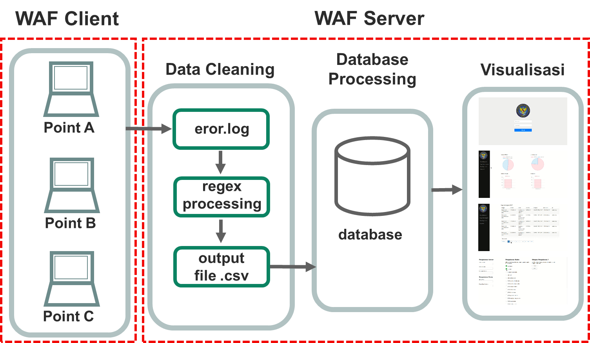

# OpenWAF

## deskripsi
aplikasi ini digunakan sebagai IPS (Intrusion Prevention System) pada web application.
untuk serangan yang dapat dideteksi dan dicegah berdasarkan **OWASP top 10**.

## kebutuhan
yang anda perlu penuhi untuk membangun ini adalah:
- apache server
- php 5.5
- mysql
- python 2.7
- ModSecurity
- shell script skill
- Regex skill

## let's ROCK
1. pertama-tama bangunlah sebuah server apache dengan topologi **reverse proxy**. untuk cara membangunnya dapat anda lakukan berdasarkan link berikut ini:
https://www.root25.com/2012/11/how-to-install-modsecurity-on-apache-ubuntu12-stepbystep-tutorial.html.
2. setelah anda berhasil membangun ini, ekstrak file **tampilMysql** dan **regexCleanLog**. 
3. untuk file **tampilMysql** anda bebas meletakkannya didirektori manapun.
4. untuk file **regexCleanLog**, pindahkan ***file clean3.py*** dan ***databaseinport2.py*** pada direktori ```/var/log/apache2```.
5. untuk database login, buat database mysql **login** dan import **login.sql**.

## penjelasan
beikut ini adalah konsep yang diterapkan pada OpenWAF

